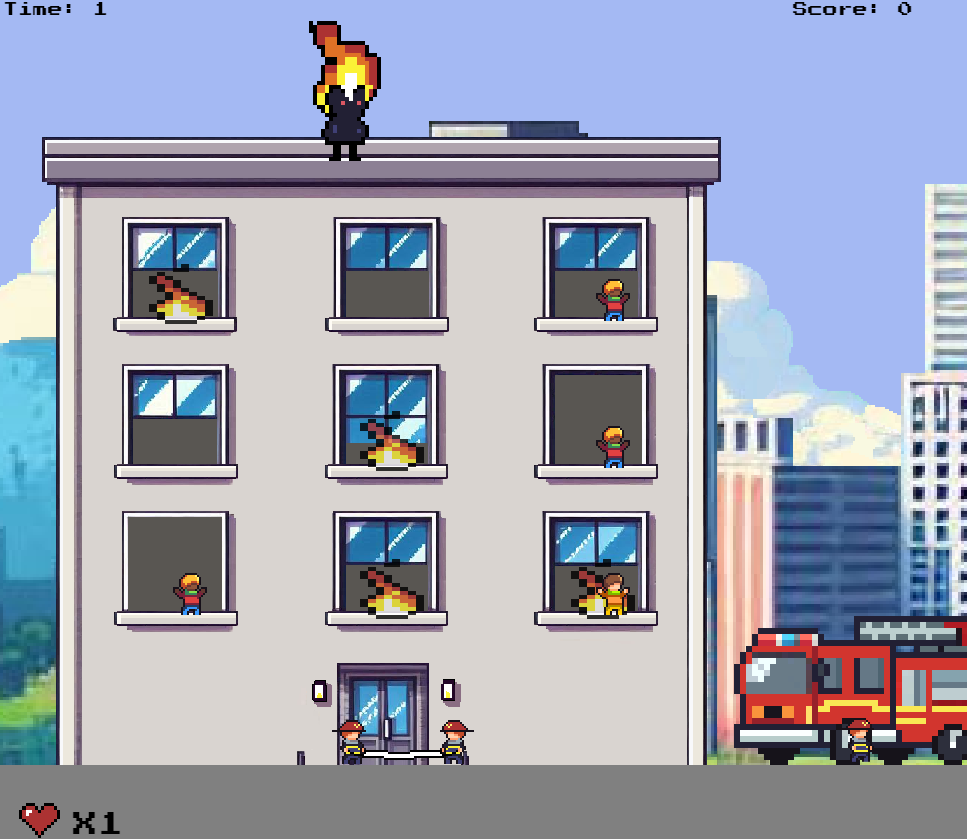
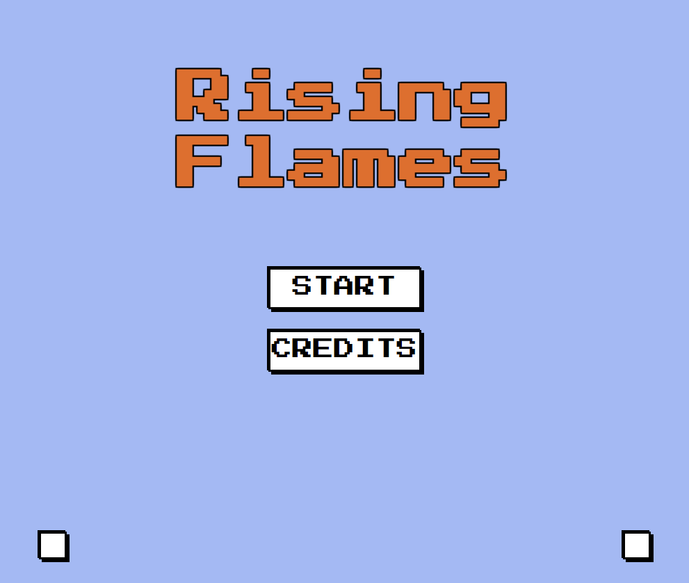

# 🔥🔥Rising_Flames🔥🔥

¡Bienvenido a Rising Flames! Un emocionante videojuego de navegador desarrollado con HTML5, CSS y JavaScript, utilizando la librería Box2D para implementar físicas realistas. Este proyecto fue creado como parte de la asignatura de Diseño Web Avanzado y tiene como objetivo aplicar conceptos de diseño, animación y desarrollo interactivo.

 

## 🛠 Descripción Técnica
El juego incluye:

HTML, CSS y JavaScript: Estructura, diseño y lógica del juego.
Firebase: Gestión de usuarios y puntuaciones en tiempo real.
Box2D: Simulación de físicas para colisiones, gravedad y rebotes.
Mecánicas destacadas:
Rescatar NPCs desde las ventanas usando teclas "E" y "Q".
Rebotes en camas elásticas para salvar vidas.
Enemigos que lanzan bolas de fuego con trayectorias aleatorias.

## 📚 Requisitos y Ejecución
Navegador compatible con HTML5 (recomendado: Google Chrome).
Clonar el repositorio, abrir index.html y jugar.
